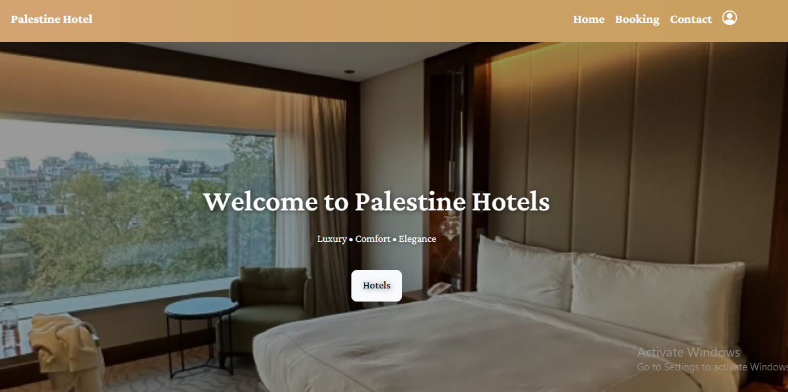

# Project Overview

This project is a hotel booking application focused on hotels in Palestine.

## Main Page
  
The main page features a button that takes the user to the "Hotels in Palestine" section.  
In the navbar, there is a link to access **My Bookings** easily.

## Hotels Booking Page
  
On this page, all available hotels are displayed.  
Users can search hotels by **location**  
  
and filter them by **price range** to find suitable options.  
 

## Hotel Details Page
  
When opening a specific hotel, the page shows a detailed description of the hotel and lists all the rooms available for booking.  
 

## Room Details Page
The page shows room details such as type, capacity, price per night, and a form to add check-in and check-out dates if the user wants to book this room.  
 

## Booking Page
When opening the booking page, all bookings made by the user are displayed.  
  

